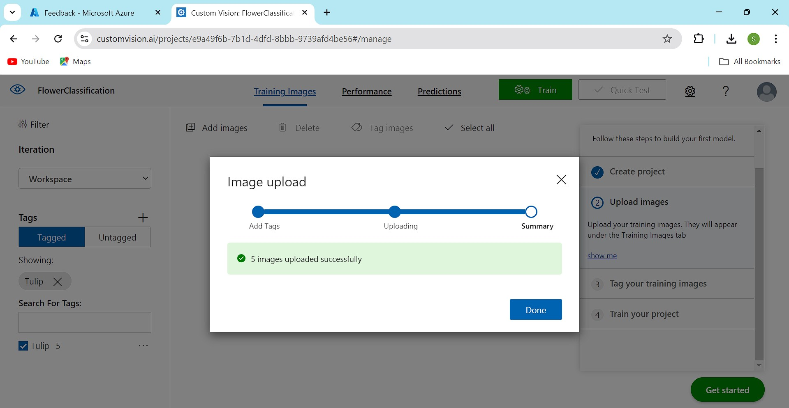
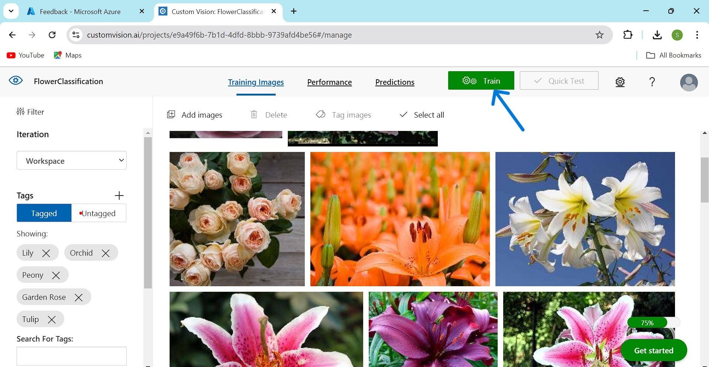
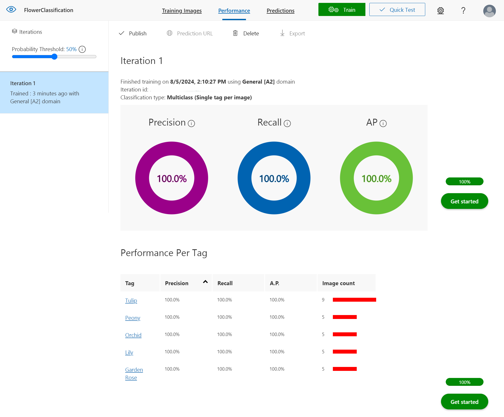
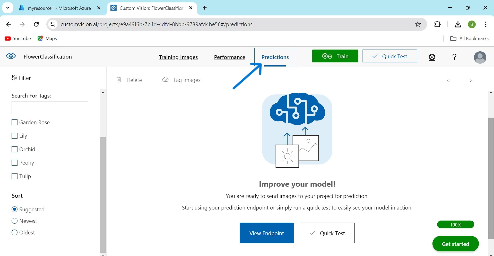

# Flower Image Classification using Azure Custom Vision

## Description

This project leverages Azure's Custom Vision service to build a robust flower image classification model. By training the model on various flower images, it can accurately identify and classify different types of flowers. The Azure Custom Vision service provides a seamless and user-friendly platform to train, deploy, and refine the model, making it accessible for developers and researchers alike. This README contains the process of setting up the environment, training the model, and using it for flower image classification tasks.

## Steps I Have Used to Build the Model

### Step 1: Creating a New Image Classification Project

First, I log in to the Microsoft Azure Custom Vision portal with my Azure account credentials. Then, I created a new Image Classification project.  

### Step 2: Uploading Images

Then I start uploading images to the project. Ideally, I uploaded them in an organized manner according to the images that will be tagged for image classification.  

### Step 3: Adding Images

I selected the "Add Images" option to upload the images. I have loaded images to tag flower images of 6 different tags:  

### Step 4: Viewing Uploaded Images

Once the image upload is finished, a screen will appear like this:  

### Step 5: Training the Model

With the data in place, I proceed to train the model.

There are two types of training to consider: 

1. **Quick Training**: Completes in the shortest possible time based on the number of images and tags.
2. **Advanced Training**: Finds the best possible model within a specified maximum time.  

I selected the Quick Training.

### Step 6: Evaluating the Model

In the Performance section, analyzing of the model is done using three metrics: Precision, Recall, and mAP (Mean Average Precision). These metrics help in understanding the following:

- **Precision**: Fraction of identified images that were correct. For example, if the model identified 100 images as hats and 99 were actually hats, the precision would be 99%.
- **Recall**: Fraction of actual classifications that were correctly identified. For example, if there were 100 images with hats and the model identified 80 as hats, the recall would be 80%.
- **mAP**: Mean value of the Average Precision (AP), which is the area under the precision/recall curve for each prediction made.  

### Step 7: Testing the Model
After training the model, I tested its performance by providing it with a test image of a flower to evaluate its prediction accuracy.

### Step 8: Publishing the Model

After establishing and testing the Custom Vision model, We can publish it from the Performance section by selecting an Iteration/Training. Once published, we can use this resource as a web API. We can also export the model in various formats such as TensorFlow, CoreML, Docker container, among others. I haven't published it online as it requires some cost.

