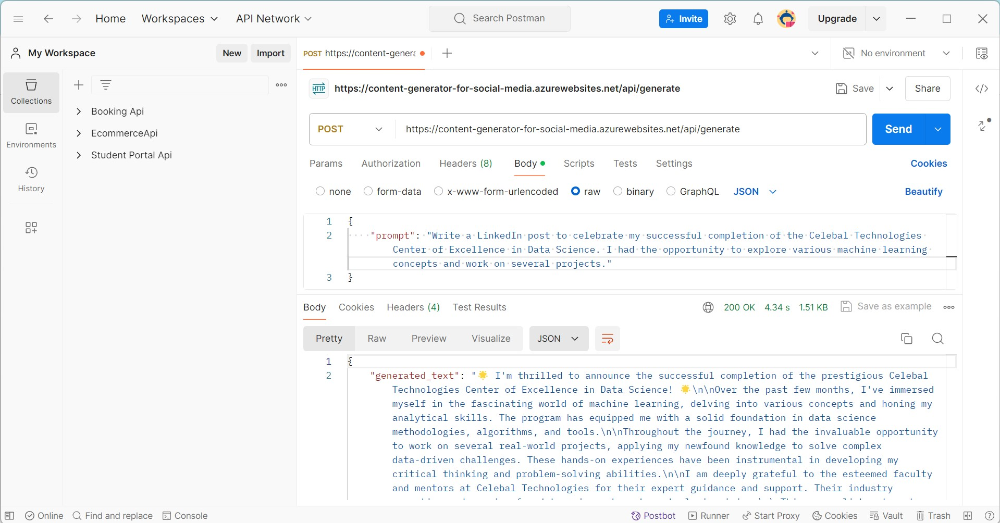
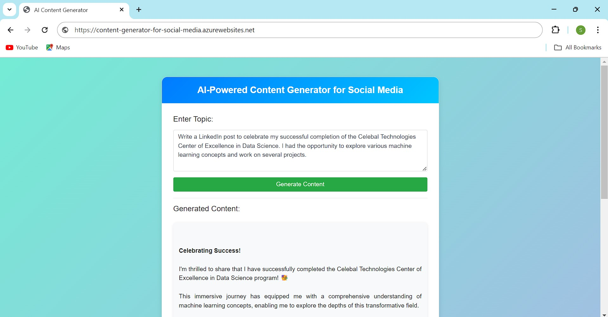
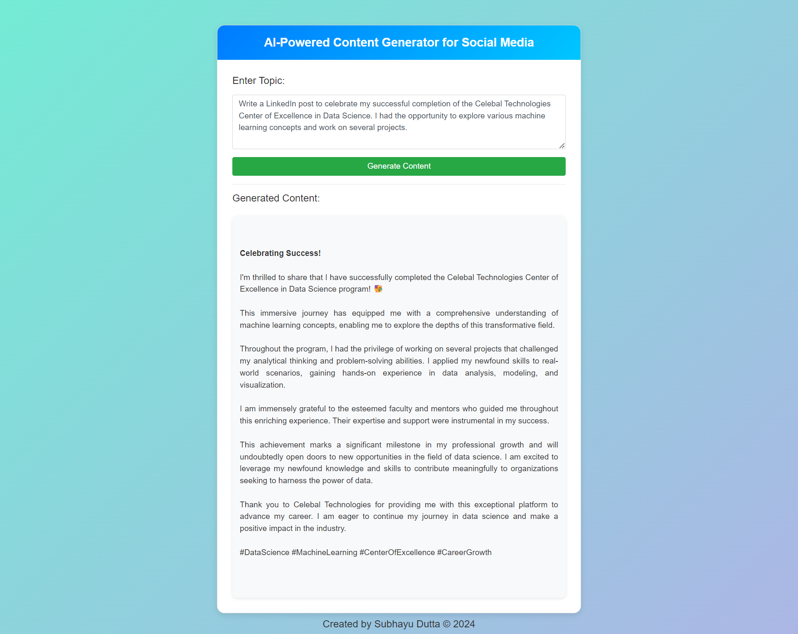

# AI-Powered Content Generator for Social Media

## Overview

The AI-Powered Content Generator for Social Media is designed to assist social media managers and marketers by generating tailored content for posts, ads, and campaigns. This application leverages advanced AI to suggest trending hashtags, write captions, and craft entire blog posts, streamlining content creation and enhancing engagement.

## Features

- **Automatic Post Generation:** Generates customized posts for various social media platforms.
- **Hashtag and Keyword Suggestions:** Provides relevant hashtags and keywords to maximize reach and engagement.
- **Trending Content Ideas:** Offers content ideas based on current trends and user interests.

## Tech Stack Used:
- Flask
- Azure OpenAI
- Azure App Service
- Python

## Deploying the API using Microsoft Azure

## Testing the API in Postman

First I opened Postman and created a new POST request. Then I set the URL. After that I set the Body to raw and use JSON format. Then I send the Request and I received a JSON response with the generated content. 

## Testing the API by interacting with Webpage
I tested the API by interacting with the HTML/CSS app interface, which allows to submit prompts and view generated content directly in your browser.

## License
This project is developed for the Week-13 assignment of Celebal Technologies Center of Excellence in Data Science. 
